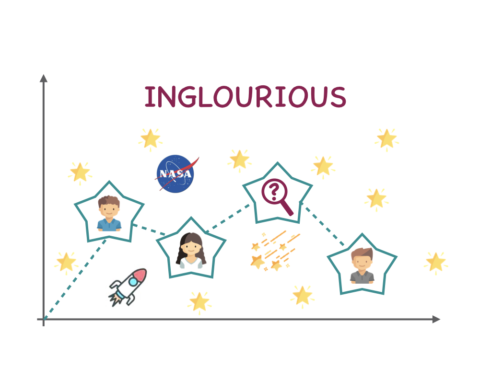

# Team: INGLOURIOUS

## NASA-hackathon

Datasets, aggregated from different sources, can have missing or incomplete values which impose difficulties on data analysis and research. The proposed project aims to build the pipeline for the recovery of various data: categorical, numerical and textual – collected from multiple resources. In the project, we focus on incomplete data, such as geographical locations (cities, places, highways, coordinates), information sources (news websites, TV channels, articles) and measured features of celestial objects (meteorites’ mass and type).

## The Project Overview 

### Background 
Machine Learning enthusiasts and AI specialists always rely on large data sets when building their models. Whether they are looking for patterns in the data or creating predictive models, complete and clean data is crucially important for positive results. We chose this challenge in order to help the scientific community, environmentalists and space researchers to computationally recover missing, although crucial data entries in the number of NASA datasets. 

### What it does 
Our project consists of three jupyter notebooks that describe the process of data recovery or cleaning for NASA datasets: (i) missing values recovery (meteorites mass, location, and type) using the best practices of data imputation in the Meteorite Landings dataset; (ii) identifying information sources from the URL links and (iii) search for the exact geographical locations given word descriptions for Global Landslide Catalog.

### NASA Resources 

- Global Landslide Catalog
- Meteorite Landings dataset

These data sets are available at data.nasa.gov and were chosen because they fit into requirements: (i) combined from various sources at different timescales, (ii) have a lot missing or incomplete data entries.

### Future Plans 
Our project requires more time for completion, 

### Built With 
Jupyter notebooks and Python 3.6 with various open source modules

### Try it out 
Our project is available on github: https://github.com/klyshko/NASA-hackathon

### Tags 
#machine learning, #artificial intelligence, #python,#missingdata, #spacedata, #scikitlean, #earth science, #meteorites, #geolocation, #urlparsing, #lgbmboost 

